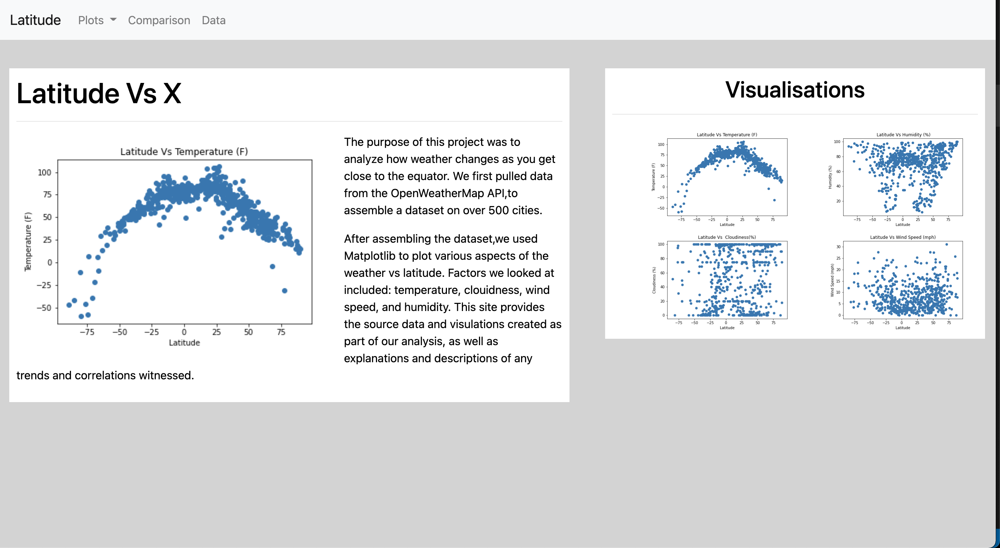

# Weather Visualisation Dashboard

## Background

Data is more powerful when we share it with others! Let's take what we've learned about HTML and CSS to create a dashboard showing off the analysis we've done.

## Latitude - Latitude Analysis Dashboard with Attitude

We'll be creating a visualisation dashboard website using visualisations we've created in a past assignment. Specifically, we'll be plotting [weather data](Resources/cities.csv).

In building this dashboard, we'll create individual pages for each plot and a means by which we can navigate between them. These pages will contain the visualisations and their corresponding explanations. We'll also have a landing page, a page where we can see a comparison of all of the plots, and another page where we can view the data used to build them.

### Website Requirements

For reference, see the ["Screenshots" section](#screenshots) below.

The website must consist of 7 pages total, including:

* A [landing page](#landing-page) containing:
  * An explanation of the project.
  * Links to each visualisations page. There should be a sidebar containing preview images of each plot, and clicking an image should take the user to that visualisation.
* Four [visualisation pages](#visualisation-pages), each with:
  * A descriptive title and heading tag.
  * The plot/visualisation itself for the selected comparison.
  * A paragraph describing the plot and its significance.
* A ["Comparisons" page](#comparisons-page) that:
  * Contains all of the visualisations on the same page so we can easily visually compare them.
  * Uses a Bootstrap grid for the visualisations.
    * The grid must be two visualisations across on screens medium and larger, and 1 across on extra-small and small screens.
* A ["Data" page](#data-page) that:
  * Displays a responsive table containing the data used in the visualisations.
    * The table must be a bootstrap table component. [Hint](https://getbootstrap.com/docs/4.3/content/tables/#responsive-tables)
    * The data must come from exporting the `.csv` file as HTML, or converting it to HTML. Try using a tool you already know, pandas. Pandas has a nifty method appropriately called `to_html` that allows you to generate a HTML table from a pandas dataframe. See the documentation [here](https://pandas.pydata.org/pandas-docs/version/0.17.0/generated/pandas.DataFrame.to_html.html)

The website must, at the top of every page, have a navigation menu that:

* Has the name of the site on the left of the nav which allows users to return to the landing page from any page.
* Contains a dropdown menu on the right of the navbar named "Plots" that provides a link to each individual visualisation page.
* Provides two more text links on the right: "Comparisons," which links to the comparisons page, and "Data," which links to the data page.
* Is responsive (using media queries). The nav must have similar behaviour as the screenshots ["Navigation Menu" section](#navigation-menu) (notice the background color change).

## **Using the Dashboard**:
Use it like any other webpage!
## **Languages used**:
- HTML
- CSS
- Bootstrap Library was used
### Considerations

* You may use the [weather data](Resources/cities.csv) or choose another dataset. 
* You must use Bootstrap. This includes using the Bootstrap `navbar` component for the header on every page, the bootstrap table component for the data page, and the Bootstrap grid for responsiveness on the comparison page.
* Be sure to use a CSS media query for the navigation menu.
* Be sure your website works at all window widths/sizes.

### Screenshots

This section contains screenshots of each page that was built, at varying screen widths. These are a guide; you can meet the requirements without having the pages look exactly like the below images.

### Landing page

Large screen:

Small screen:


*Note the page scrolls down*

#### Comparisons page

Large screen:

Small screen:

#### Data page

Large screen:

Small screen:

#### Navigation menu

Large screen:

Small screen:

### Copyright

© 2021 Trilogy Education Services, LLC, a 2U, Inc. brand. Confidential and Proprietary. All Rights Reserved.

  

